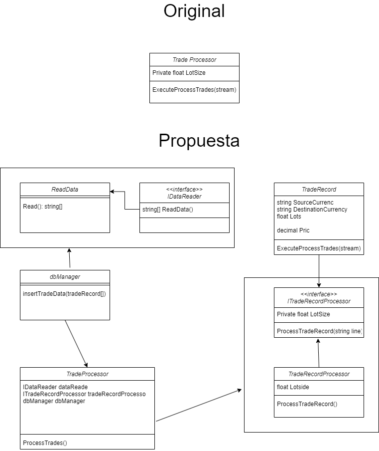

# P01-Principio-SOLID

Modificaciones al codigo

Primeramente usamos interfaces para las diferentes clases que se crearon

Luego se separaron en diferentes clases para que cada clase se enfocara en una actividad

Este codigo creemos que siguen los principios SOLID

